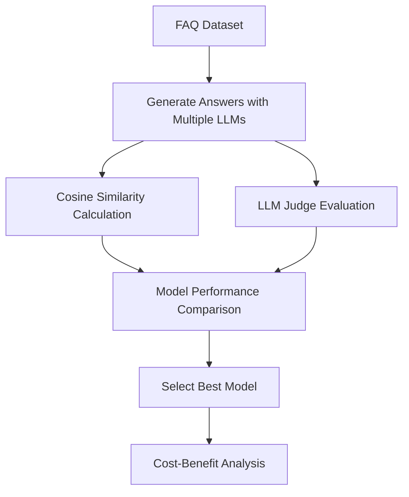

# RAG Evaluation: Offline vs Online Methods

Evaluating RAG (Retrieval-Augmented Generation) systems is crucial for ensuring quality responses and optimizing performance. This document outlines the key evaluation approaches and their applications.

## Evaluation Categories

### Offline Evaluation

Offline evaluation is performed using existing datasets and doesn't require real user interaction. It's faster, cheaper, and allows for systematic comparison of different approaches.

#### 1. Cosine Similarity

- **Purpose**: Measures semantic similarity between generated and reference answers
- **Method**: Compares vector embeddings of text using cosine distance
- **Range**: -1 to 1 (higher values indicate greater similarity)
- **Use Cases**:
  - Compare multiple LLM models for the same FAQ dataset
  - Determine which model provides answers closest to expected responses
  - Cost-effective model selection (accuracy vs pricing)

#### 2. LLM as a Judge

- **Purpose**: Uses an LLM to evaluate the relevance and quality of generated answers
- **Method**: Prompts a judge LLM to compare generated answers against original/reference answers
- **Output Categories**:
  - **RELEVANT**: Generated answer fully addresses the question with accurate information
  - **PARTIALLY_RELEVANT**: Generated answer is somewhat related but incomplete or partially incorrect
  - **NON_RELEVANT**: Generated answer is unrelated or completely incorrect
- **Advantages**:
  - More nuanced evaluation than simple similarity metrics
  - Can assess semantic correctness beyond surface-level similarity
  - Provides explanations for judgments

### Online Evaluation

Online evaluation involves real users and production environments, providing insights into actual user experience and system performance.

#### 1. A/B Testing & Experiments

- **Purpose**: Compare different RAG configurations in production
- **Method**: Split traffic between different models/approaches
- **Metrics**: Response time, user engagement, task completion rates
- **Applications**: Model comparison, feature rollout, performance optimization

#### 2. User Feedback

- **Purpose**: Direct assessment from end users
- **Methods**:
  - Thumbs up/down ratings
  - Detailed feedback forms
  - Usage analytics
- **Benefits**: Real-world validation, user satisfaction measurement

## Focus: Offline Evaluation Strategy

### Primary Goal: Cosine Similarity Analysis

The main objective is to perform comprehensive offline evaluation using **cosine similarity** to:

1. **Compare LLM Performance**: Evaluate multiple LLM models against the same FAQ dataset
2. **Quality Assessment**: Measure how closely generated answers match original/expected answers
3. **Cost-Effectiveness Analysis**: Identify which model provides the best balance of:
   - Answer quality (similarity scores)
   - Operational cost (API pricing, compute requirements)
   - Response speed

### Secondary Goal: LLM Judge Evaluation

Complement similarity metrics with **LLM-as-a-judge** evaluation to:

1. **Semantic Validation**: Ensure answers are not just similar but actually correct
2. **Relevance Classification**: Categorize each generated answer as:
   - **RELEVANT**: Complete and accurate response
   - **PARTIALLY_RELEVANT**: Partially correct or incomplete
   - **NON_RELEVANT**: Incorrect or unrelated response
3. **Detailed Analysis**: Obtain explanations for each judgment to understand failure modes

## Implementation Workflow

## Benefits of This Approach

- **Systematic Comparison**: Objective metrics for comparing different LLM models
- **Cost Optimization**: Identify the most cost-effective model that meets quality requirements
- **Scalable Evaluation**: Can be automated and run on large datasets
- **Quality Assurance**: Dual evaluation (similarity + judgment) provides comprehensive assessment
- **Decision Support**: Data-driven model selection for production deployment

This offline evaluation strategy provides a solid foundation for RAG system optimization before deploying to production, where online evaluation methods can further validate performance with real users.
